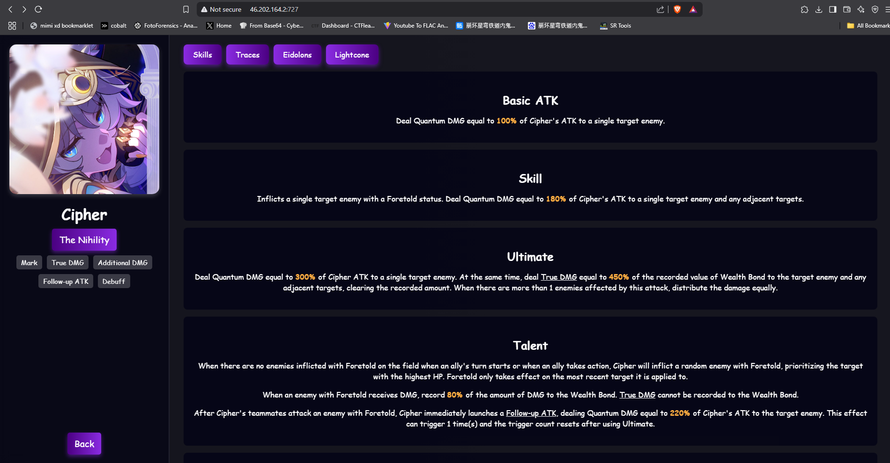
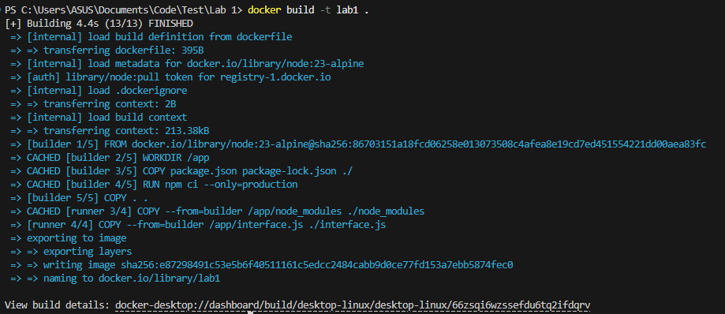
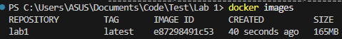
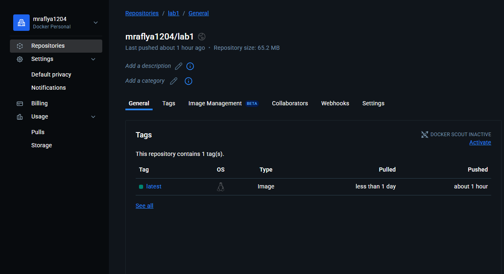
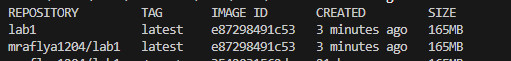
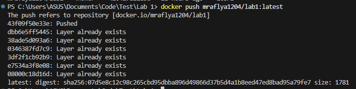
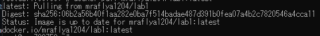
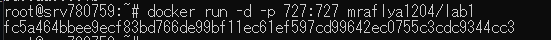
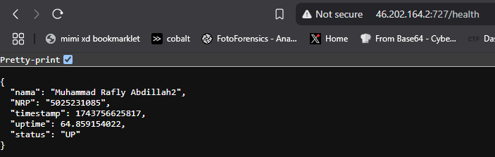
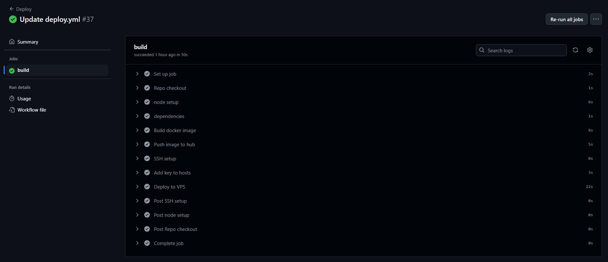

# Laporan Modul 1 OPREC NETICS 
### API LINK: http://46.202.164.2:727/health
### DOCKER IMAGE: https://hub.docker.com/repository/docker/mraflya1204/lab1

## Pembuatan API
Pada modul ini, pembuatan API dilakukan menggunakan Express.js sebagai framework. Framework dibentuk dalam file `interface.js` dengan detail sebagai berikut:
```js
const express = require('express');
const path = require('path');

const app = express();
app.use(express.static(path.join(__dirname)));

app.get('/health', (req, res) => {
    const time = Date.now();
    const uptime = process.uptime();

    res.json({
        nama: "Muhammad Rafly Abdillah2",
        NRP: "5025231085",
        timestamp: time,
        uptime: uptime,
        status: "UP"
    });
});

app.get('/', (req, res) => {
    res.sendFile(path.join(__dirname, 'index.html'));
});

const PORT = process.env.PORT || 727;
app.listen(PORT, () => {

});
```
Pertama `express` akan di initiate untuk memerlukan module `express` dari `node.js`. Demikian pula dengan module `path`. Setelah itu, deklarasikan `app` sebagai instance dari `express`.`app.use(express.static(path.join(__dirname)));` akan menyajikan static file yang ada pada folder. Hal ini dilakukan agar `index.html` yang akan disajikan pada root url dapat mendeteksi asset asset yang diperlukan. Kemudian setup GET request `/health` untuk mengeluarkan file `out.json`. File tersebut memiliki beberapa attribute seperti `nama`, `NRP`, `timestamp`, `uptime`, dan juga `status`. 

Sebelum mendeklarasikan `output.json`, terlebih dahulu deklarasikan `time` dan juga `uptime` yang akan dipakai oleh `output.json`. 

Karena `timestamp` memerlukan timestamp berupa berapa detik yang telah berlalu sejak epoch, yaitu setelah 1 Januari 1970, dapat digunakan inbuilt function `Date.now()` untuk mendapatkan timestamp yang diperlukan. Untuk `uptime` sendiri, dapat digunakan `process.uptime` yang akan melacak seberapa lama process (dalam hal ini, server API) telah berjalan.


Selanjutnya, ketika host diakses tanpa memanggil API `/health`, akan di return sebuah webpage.



Setelah semua deklarasi tersebut, PORT akan dibuka agar API dapat diakses melalui host. Untuk API ini, digunakan port 727.

## Setup Dockerfile untuk Container
Untuk membuat Container, kita perlu untuk membuat sebuah `dockerfile` terlebih dahulu. Dockerfile ini akan menginstruksikan bagaimana Docker dapat wrap sebuah aplikasi (dalam hal ini, API kita). Disini saya menggunakan Docker Multi-Stage yang artinya Builder dan juga Runner image dipisah.
```dockerfile
# BUILDER
FROM node:23-alpine AS builder

WORKDIR /app

COPY package.json package-lock.json interface.js index.html cipher.png styles.css ./
RUN npm ci --only=production

# RUNNER
FROM node:23-alpine AS runner

WORKDIR /app

COPY --from=builder /app/node_modules node_modules
COPY --from=builder /app/interface.js interface.js
COPY --from=builder /app/index.html index.html
COPY --from=builder /app/cipher.png cipher.png
COPY --from=builder /app/styles.css styles.css

EXPOSE 727

CMD ["node", "interface.js"]
```
Dalam proyek ini, node:alpine-23 digunakan sebagai builder dan runner karena lightweight dan support untuk proyek `node.js`. 

Pada tahap builder, deklarasikan `WORKDIR` ke folder `app`. Lalu copy `package.json`, `package-lock.json`, `interface.js`, `index.html`, dan juga asset assetnya ke `WORKDIR`. Semua file tersebut penting agar ketika image dijalkan nanti, mereka dapat mengenali package apa saja yang diperlukan untuk menjalankan API yang telah dibuat dan `interface.js` yaitu API itu sendiri. Kemudian `npm ci --only=production` akan install dependencies (jika mesin perlu) dan juga akan menggunakan yang perlu pada tahap production saja (package tahap dev akan diskip). 

Pada tahap runner, semua file penting yang telah terinstall akan ditransfer agar bisa dijalankan oleh runner.  Setelah port 727 akan dibukan untuk menjalankan API. kemudian command `node interface.js` akan menjalankan API tersebut.

## Build Container Image
Ketika Dockerfile sudah siap, command `docker build` dapat dijalnkan untuk membuat image dari aplikasi. Untuk ini, command `docker build -t lab1 /src` akan digunakan yang akan membuat image docker baru dengan nama `lab1`.



Untuk cek apakah image telah berhasil dibuat, command `docker images` dapat digunakan



Setelah docker image selesai dibuat, tahap selanjutnya adalah untuk melakukan push ke repository docker hub. Hal ini dilakukan agar VPS hanya perlu pull image terbaru saja dari docker hub ketika sebuah aksi push di github dilakukan.

Untuk upload ke docker hub, tag image yang telah dibuat harus diganti sesuai ke repository docker hub yang telah dibuat. Disini docker hub repository yang digunakan adalah `mraflya1204/lab1`. 



`lab1` yang telah dibuat akan direname dengan menggunakan command `docker tag lab1 mraflya1204/lab1:latest`.



Setelah direname, lakukan push dengan command `docker push` dengan menyertakan tag yang telah telah dibuat sebelumnya. `docker push mraflya1204/lab1:latest`



## Deployment pada VPS
Untuk proyek ini, VPS yang digunakan adalah dari `Hostinger`. Sebagai setup, terlebih dahulu install docker di VPS karena akan VPS akan menggunakan docker image yang telah dibuat sebelumnya. 


Selanjutnya, pull dari docker image terbaru yang telah di push. Karena repository docker hub dibuat publik, VPS tidak perlu login ke docker hub dan bisa langsung melakukan pull `docker pull mraflya1204/lab1:latest`. 



Setelah pull selesai, lakukan `docker run` untuk menjalankan API yang telah di deploy. `docker run -d -p 727:727 mraflya1204/lab1`



Karena menggunakan opsi `-d`, process API akan berjalan pada background. API yang telah dideploy dapat diakses dengan menggunakan koneksi ke IP dari VPS. Disini IP VPS yang dipakai adalah `46.202.164.2`. Kemudian, specify port yang akan diakses. Karena disini port 727 digunakan, API yang telah dideploy dapat diakses melalui `http://46.202.164.2:727/health`.



## Otomasi menggunakan Github Actions
```yaml
name: Deploy

on: 
  push:
    paths-ignore:
      - 'README.md' #I need this since I'm writing the report and it keep updating my VPS
      - 'media' #Also this is unimportant for the deployment

jobs:
  build:
    runs-on: ubuntu-latest
    steps:
    - name: Repo checkout
      uses: actions/checkout@v3

    - name: node setup
      uses: actions/setup-node@v3
      with:
        node-version: '23'
        cache: 'npm'
        cache-dependency-path: src/package-lock.json

    - name: dependencies
      run: |
        cd src
        npm ci --only=production

    - name: Build docker image
      run: |
        docker build -t lab1 src/
        docker tag lab1 mraflya1204/lab1:latest

    - name: Push image to hub
      run: |
        echo ${{ secrets.DOCKER_PASSWORD }} | docker login -u ${{ secrets.DOCKER_USERNAME }} --password-stdin
        docker push mraflya1204/lab1:latest

    - name: SSH setup
      uses: webfactory/ssh-agent@v0.9.0
      with: 
        ssh-private-key: ${{ secrets.SSH_KEY }}

    - name: Add key to hosts
      run: |
        ssh-keyscan -H ${{ secrets.SSH_IP }} >> ~/.ssh/known_hosts
        
    - name: Deploy to VPS
      run: |
        ssh ${{ secrets.SSH_USER }}@${{ secrets.SSH_IP }} << 'EOF'
          docker stop $(docker ps -a -q)
          docker pull mraflya1204/lab1:latest
          docker run -d -p 727:727 mraflya1204/lab1
        EOF
```
Agar dapat melakukan otomasi deploy setiap ada update pada repository, akan digunakan github actions. Sebelumnya sudah diset beberapa github secrets yang memuat informasi sensitif seperti `SSH_KEY`, `SSH_IP`, `DOCKER_USERNAME`, `DOCKER_PASSWORD`, dan sebagainya.

```yaml
on: 
  push:
    paths-ignore:
      - 'README.md' #I need this since I'm writing the report and it keep updating my VPS
      - 'media' #Also this is unimportant for the deployment
```
Bagian ini memerintahkan github actions untuk menjalankan script `yml` ketika ada aksi push terhadap repositori. Ada beberapa exception seperti `README.md` dan juga `media` folder yang ketika dipush tidak akan trigger github actions.

```yaml
  build:
    runs-on: ubuntu-latest
```
Github actions akan menggunakan ubuntu sebagai pelaksana perintah.

```yaml
    steps:
    - name: Repo checkout
      uses: actions/checkout@v3
```
Langkah pertama yang dilakukan adalah melakukan checkout repository untuk fetch code yang ada.

```yaml
    - name: node setup
      uses: actions/setup-node@v3
      with:
        node-version: '23'
        cache: 'npm'
        cache-dependency-path: src/package-lock.json
```
Selanjutnya github actions akan inisialisasi node.js environment. Dilakukan juga caching npm agar dependencies yang sudah terinstall tidak perlu diinstall ulang. 

```yaml
    - name: dependencies
      run: |
        cd src
        npm ci --only=production    
```
Berikutnya, dependencies yang diperlukan akan diinstall melalui `npm ci`, opsi `only=production` memastikan bahwa hanya dependencies yang diperlukan dalam production saja yang diinstall. 

```yaml
    - name: Build docker image
      run: |
        docker build -t lab1 src/
        docker tag lab1 mraflya1204/lab1:latest
```
Kemudian, github actions akan melakukan build docker sesuai dengan `dockerfile` yang telah dispesifikasikan di repository. Setelah dibuild, image akan ditag dengan nama yang sesuai dengan repository docker hub agar bisa dipush.

```yaml
    - name: Push image to hub
      run: |
        echo ${{ secrets.DOCKER_PASSWORD }} | docker login -u ${{ secrets.DOCKER_USERNAME }} --password-stdin
        docker push mraflya1204/lab1:latest
```
Sekarang, github actions akan melakukan login ke docker hub dengan menggunakan login credentials yang disembunyikan melalui github secrets. Setelah login berhasil, github action akan melakukan push image yang telah dibuat ke repository yang sesuai.

```yaml
    - name: SSH setup
      uses: webfactory/ssh-agent@v0.9.0
      with: 
        ssh-private-key: ${{ secrets.SSH_KEY }}

    - name: Add key to hosts
      run: |
        ssh-keyscan -H ${{ secrets.SSH_IP }} >> ~/.ssh/known_hosts
        
```
Kedua action tersebut digunakan untuk setup akses SSH ke VPS.`ssh-agent` digunakan untuk melakukan load SSH key dari github secrets ke runner. Kemudian SSH key tersebut akan ditambah ke `known_host` agar runner tidak perlu melakukan konfirmasi koneksi

```yaml
    - name: Deploy to VPS
      run: |
        ssh ${{ secrets.SSH_USER }}@${{ secrets.SSH_IP }} << 'EOF'
          docker stop $(docker ps -a -q)
          docker pull mraflya1204/lab1:latest
          docker run -d -p 727:727 mraflya1204/lab1
        EOF
```
Setelah setup SSH, credentials SSH tersebut akan digunakan untuk melakukan remote connection ke VPS. Setelah berhasil masuk, akan dilakukan command `docker stop $(docker ps -a -q)` untuk menghentikan semua container yang sedang berjalan. Setelah itu VPS akan melakukan `docker pull mraflya1204/lab1:latest` untuk pull docker image terbaru. Setelah berhasil, akan dirun menggunakan `docker run -d -p 727:727 mraflya1204/lab1`.



**Dengan otomasi tersebut, apabila sebuah update pada aplikasi API dilakukan, github akan langsung otomatis melakukan deploy ke VPS.**
