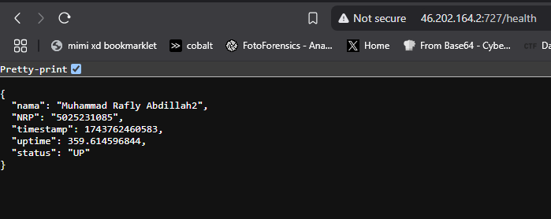
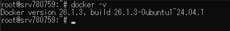

# Laporan Modul 1 OPREC NETICS 
### API LINK: http://46.202.164.2:727/health
### DOCKER IMAGE: https://hub.docker.com/repository/docker/mraflya1204/lab1

## Pembuatan API
Pada modul ini, pembuatan API dilakukan menggunakan Express.js sebagai framework. Framework dibentuk dalam file `interface.js` dengan detail sebagai berikut:
```js
const express = require('express');
const path = require('path');

const app = express();
app.use(express.static(path.join(__dirname)));

app.get('/health', (req, res) => {
    const time = Date.now();
    const uptime = process.uptime();

    res.json({
        nama: "Muhammad Rafly Abdillah2",
        NRP: "5025231085",
        timestamp: time,
        uptime: uptime,
        status: "UP"
    });
});

app.get('/', (req, res) => {
    res.sendFile(path.join(__dirname, 'index.html'));
});

const PORT = process.env.PORT || 727;
app.listen(PORT, () => {

});
```
Pertama kita specify bahwa `express` memerlukan module `express` dari `node.js`. Demikian pula dengan module `path`. Setelah itu, kita deklarasikan `app` sebagai instance dari `express`. Kita akan mendeklarasikan `app.use(express.static(path.join(__dirname)));` yang akan menyajikan static file yang ada pada folder kita. Hal ini dilakukan agar `index.html` yang akan kita sajikan pada root url dapat mendeteksi asset asset yang diperlukan. Setelah itu, kita deklarasi untuk GET request `/health` untuk mengeluarkan file `out.json`. File tersebut memiliki beberapa attribute seperti `nama`, `NRP`, `timestamp`, `uptime`, dan juga `status`. 

Sebelum mendeklarasikan `output.json` kita terlebih dahulu mendeklarasikan `time` dan juga `uptime` yang akan dipakai oleh `output.json`. 

Karena `timestamp` memerlukan timestamp berupa berapa detik yang telah berlalu sejak epoch, yaitu setelah 1 Januari 1970, kita dapat menggunakan inbuilt function `Date.now()` untuk mendapatkan timestamp yang diperlukan. Untuk `uptime` sendiri, kita dapat menggunakan `process.uptime` yang akan melacak seberapa lama process (dalam hal ini, server API) telah berjalan.



Selanjutnya, ketika host diakses tanpa memanggil API `/health`, akan di return sebuah webpage.


Setelah semua deklarasi tersebut, PORT akan dibuka agar API dapat diakses melalui host. Untuk API ini, saya menggunakan port 727.

## Setup Dockerfile untuk Container
Untuk membuat Container, kita perlu untuk membuat sebuah `dockerfile` terlebih dahulu. Dockerfile ini akan menginstruksikan bagaimana Docker dapat wrap sebuah aplikasi (dalam hal ini, API kita). Disini saya menggunakan Docker Multi-Stage yang artinya Builder dan juga Runner image dipisah.
```dockerfile
# BUILDER
FROM node:23-alpine AS builder

WORKDIR /app

COPY package.json package-lock.json interface.js index.html cipher.png styles.css ./
RUN npm ci --only=production

# RUNNER
FROM node:23-alpine AS runner

WORKDIR /app

COPY --from=builder /app/node_modules node_modules
COPY --from=builder /app/interface.js interface.js
COPY --from=builder /app/index.html index.html
COPY --from=builder /app/cipher.png cipher.png
COPY --from=builder /app/styles.css styles.css

EXPOSE 727

CMD ["node", "interface.js"]
```
Dalam proyek ini, saya menggunakan node:alpine-23 sebagai builder dan runner karena lightweight dan support untuk proyek `node.js`. 

Pada tahap builder, kita deklarasikan `WORKDIR` kita ke folder `app`. Lalu kita copy `package.json`, `package-lock.json`, `interface.js`, `index.html`, dan juga asset assetnya ke `WORKDIR`. Semua file tersebut penting agar ketika image dijalkan nanti, mereka bisa tau package apa saja yang diperlukan untuk menjalankan API yang telah kita buat dan `interface.js` yaitu API kita sendiri. Kemudian kita akan run `npm ci --only=production` yang akan install dependencies (jika mesin perlu) dan juga akan menggunakan yang perlu pada tahap production saja (package tahap dev akan diskip). 

Pada tahap runner, kita akan tranfer semua file penting yang telah terinstall agar bisa dijalankan oleh runner.  Setelah itu kita akan membuka PORT 727 untuk digunakan oleh API. Setelah itu kita akan jalankan command `node interface.js` yang akan menjalankan API tersebut.

## Build Container Image
Ketika Dockerfile sudah siap, kita dapat menjalankan command `docker build` untuk membuat image dari aplikasi kita. Untuk ini, saya menggunakan command `docker build -t lab1 .` yang akan membuat image docker baru dengan nama `lab1`.


Untuk cek apakah image telah berhasil dibuat, kita dapat menggunakan command `docker images`


Setelah docker image selesai dibuat, tahap selanjutnya adalah untuk melakukan push ke repository docker hub. Hal ini dilakukan agar nanti VPS tinggal pull image terbaru saja dari docker hub ketika sebuah aksi push di github dilakukan.

Untuk upload ke docker hub, kita harus mengganti tag image yang telah dibuat sesuai ke repository docker hub yang telah dibuat. Disini saya menamakan docker hub repository saya dengan `mraflya1204/lab1`. 


Kita akan rename image `lab1` yang telah dibuat dengan menggunakan command `docker tag lab1 mraflya1204/lab1:latest`. Sekarang image tersebut akan direname menjadi `mraflya1204/lab1`


Setelah direname, kita akan melakukan push dengan command `docker push` dengan menyertakan tag yang telah kita buat sebelumnya. `docker push mraflya1204/lab1:latest`


## Deployment pada VPS
Untuk proyek ini, saya menggunakan VPS dari `Hostinger`. Sebagai setup, kita harus terlebih dahulu menginstall docker karena akan kita pakai image yang telah kita buat sebelumnya. 



Selanjutnya, kita akan melakukan pull dari docker image terbaru yang telah kita push. Karena repository docker hub saya dibuat publik, kita tidak perlu melakukan login pada VPS dan bisa langsung melakukan pull `docker pull mraflya1204/lab1:latest`. 


Setelah pull selesai, kita hanya perlu untuk melakukan `docker run` untuk menjalankan API yang telah di deploy. `docker run -d -p 727:727 mraflya1204/lab1`


Karena kita menggunakan opsi `-d`, process API akan berjalan pada background. Kita dapat mengakses API yang telah dideploy dengan menggunakan koneksi ke IP dari VPS. Disini IP VPS saya adalah `46.202.164.2`. Lalu kita bisa specify port yang kita gunakan. Karena disini saya menggunakan port 727, untuk mengakses API yang telah dideploy yaitu dengan url `http://46.202.164.2:727/health`.


